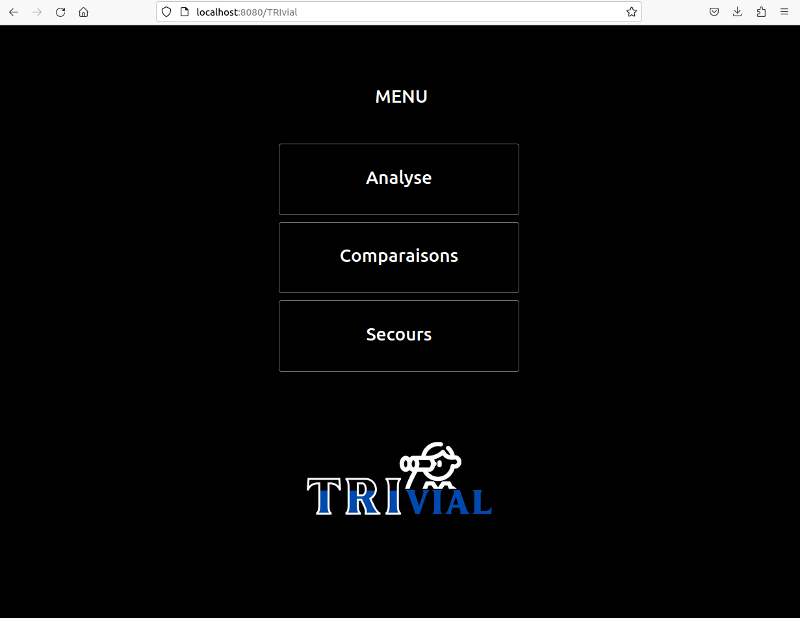
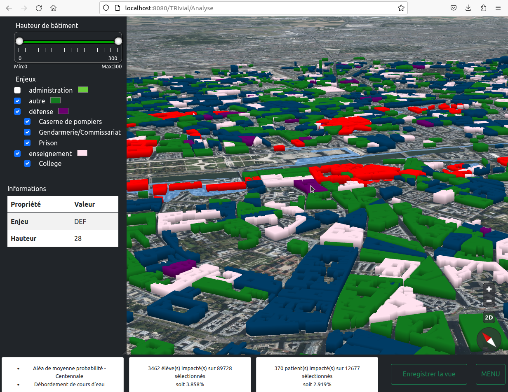
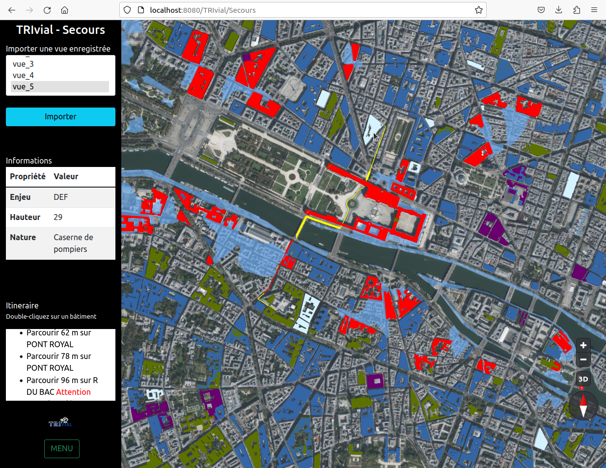
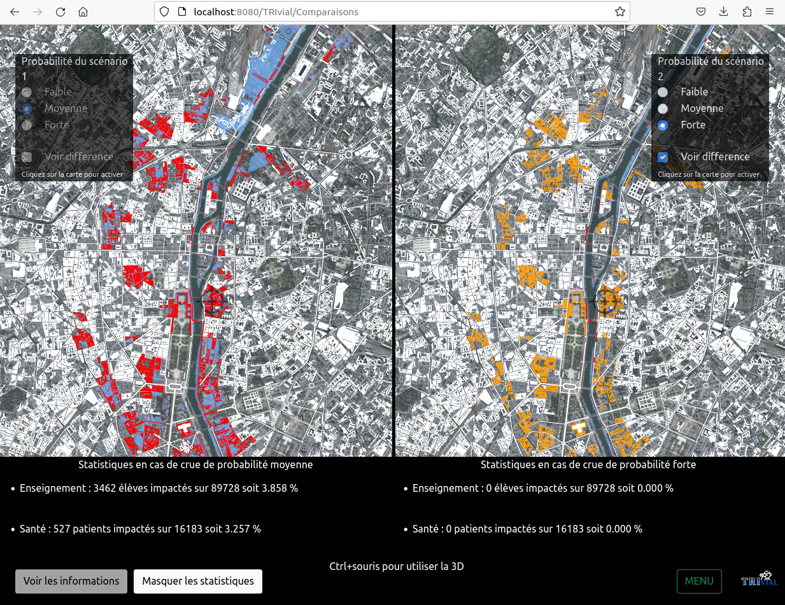

**Manuel d'Utilisation - Projet de Fin d'Etudes - TRIvial** 
=======
Etudiant·e·s en Master 2/troisième année d'Ingénieur·e, spécialité **Technologies des Systèmes d'Information (TSI)**, à l'ENSG-Géomatique.

*Ce manuel d'utilisation est un fichier contenant des informations sur l'utilisation de notre preuve de concept, les autres fichiers du même répertoire et le contenu du rendu de notre projet.*

## Table des matières
1. [Déploiement](#Déploiement)
2. [Tutoriel-d-installation](#Tutoriel-d-installation)
3. [Informations](#Informations)
4. [Description](#Description)
5. [Pré-requis](#Pré-requis)
6. [Contenu](#Contenu)

# Deploiement
Se rendre sur le [Tutoriel d'Installation](https://github.com/Bmaeve/TRIvial/blob/dev/README.md).
***

# Tutoriel d'utilisation
Notre preuve de concept TRIvial : [http://localhost:8080/TRIvial](http://localhost:8080/TRIvial). C'est le menu principal de redirection figure \ref{menu}. 
  

**L'application est divisée en trois pages :**

### La page Analyse
Elle permet à l'utilisateur de visualiser et d'analyser les scénarios et leurs enjeux ainsi que de prendre des décisions lors de la gestion d'une crise liée à une inondation. Une carte 2D/3D s'affiche avec une partie à gauche comprenant trois onglets de sélection :
- Scénario : permet de choisir le scénario d'aléa à afficher, il peut être de probabilité faible, moyenne ou forte. Ces choix sont générés automatiquement à partir des scénarios disponibles dans la Base de Données ;
- Hauteur des bâtiments : Filtre les bâtiments selon leur hauteur ;
- Enjeux : Générés automatiquement à partir des données disponibles dans la Base de Données, ces onglets permettent de filtrer les enjeux par leurs types et sous types. La couleur de réprésentation d'une catégorie d'enjeux peut également être choisie.  

Lors de la validation, les données sélectionnées par les filtres sont affichées sur la carte. Les enjeux touchés par le scénario concerné s'affichent en rouge. La sélection (clic) d'un objet sur la carte (bâtiment, etc.) fait afficher les informations de ce dernier dans l'onglet *Informations*. Les statistiques affichées en bas de la page concernent les enjeux Enseignement et Santé, ells présentent quelle proportion des enjeux a été touchée, avec le nombre de personnes concernées. Le bouton *Enregistrer* la vue permet d'enregistrer, dans un fichier json, les filtres de sélection des données (le scénario, la hauteur des bâtiments et les enjeux, ainsi que leur couleur). 
  

### La page Secours
Elle permet aux secouristes de visualiser une vue enregistrée par un utilisateur de la partie Analyse. Ils peuvent alors choisir l'itinéraire à prendre pour secourir un enjeu sélectionné. Une carte 2D/3D s'affiche avec une partie à gauche comprenant un onglet de sélection *Importer une vue enregistrée*, un affichage d'informations *Informations*, un affichage des étapes d'un itinéraire *Itinéraire* et un bouton *Menu* sont affichés au bas de l'écran. L'utilisateur a la possibilité de sélectionner une vue enregistrée précédemment via la page Analyse. De même que sur la page Analyse, lorsqu'il sélectionne (clique) sur un objet sur la carte (bâtiment, etc.), les informations de ce dernier s'affichent dans l'onglet *Informations*.  

Lorsque l'utilisateur effectue un clic-long (d'une seconde), un itinéraire est calculé et s'affiche entre l'objet sélectionné et la caserne de pompiers la plus proche. L'itinéraire choisi est représenté en jaune, il passe cependant par des routes inondées, alors représentées en rouge. La prise en compte du réseau touché par le scénario représente une amélioration future.
  

### La page Comparaisons
Elle permet aux utilisateurs de comparer et d'analyser des scénarios. Cette page est composée :
- de deux cartes 2D effectuant les mêmes mouvements de caméra en parallèle. Pour chacune d'elle la sélection d'un scénario permet d'afficher en rouge les bâtiments touchés par ce scénario et en blanc le reste des bâtiments ;
- des boutons *Voir les informations*, *Voir les statistiques et *Menu*.

L'utilisateur a la possibilité de cliquer sur le bouton *Voir les informations* et de sélectionner une catégorie de bâtiments (dans la barre de choix) ou un bâtiment (dans la table) pour obtenir des informations. En cliquant sur un enjeu dans la liste qui s'affiche, un zoom s'effectue sur celui-ci. Puis, il peut cliquer sur le bouton *Masquer les informations*. De la même manière, l'utilisateur a la possibilité de cliquer sur le bouton *Voir les statistiques* pour afficher les statistiques des scénarios. Lorsque l'utilisateur clique sur le bouton *Voir différence* d'un côté ou de l'autre (dans le scénario à droite ou à gauche), les bâtiments touchés sur un seul des deux scénarios sont affichés en orange.
  
***

# Informations
#### **Auteur·rice·s** :
Emma BOLMIN, Jonathan-Boris OUEDRAOGO, Baptiste RIVIERE et Maeve BLAREL, étudiant·e·s en Master 2/troisième année d'Ingénieur·e, spécialité **Technologies des Systèmes d'Information (TSI)**, à l'ENSG-Géomatique.
#### **Commanditaires** :
Quentin BOUILLAGUET, Line GALLEN et Madec GERMERIE-GUIZOUARN, Ingénieur·e·s à l'IGN.
#### **Responsable pédagogique de la formation TSI** :
Victor COINDET, responsable de la filière TSI.
#### **Durée du projet** :
20 mars 2023 - 28 avril 2023.
#### **URL du site, de la solution** :
[Preuve de concept TRIvial](http://localhost:8080/TRIvial).
#### **Le projet et ses objectifs** :
Ce projet a été réalisé dans le cadre du module Projet de Fin d'Etudes de la formation TSI. Nous intégrons le projet INONDATA de l'IGN. L'objectif est de réaliser un prototype visuel permettant l'aide à la gestion de crises liées aux inondations et aux submersions marines.
#### **Langages utilisés** :
+ HTML5, CSS3, XML ;
+ JavaScript ;
+ PHP, PostgreSQL/PostGIS ;
+ LaTeX, Markdown.
#### **Logiciels utilisés** :
+ FileZilla ;
+ GitHub ;  
+ Office ;
+ Overleaf ;
+ phpPgAdmin ;
+ Visual Studio Code.
#### **Données utilisées** :
Nous utilisons des données TRI ouvertes sur la ville de Paris (75), des données de recoupements provenant de diverses sources (site SEVEZO, données MENJVA, données FINESS BD TOPO, etc. (découvertes lors du Benchmarking)).
#### **Récupération du projet** :
Aller vers https://github.com/Bmaeve/TRIvial.git et télécharger le ZIP du projet.
#### **Responsive?** :
Oui, il est responsive.
***

# Description
La promo de TSI (Technologies des Systèmes d'Information) de l'École Nationale des Sciences Géographiques (ENSG) ont été invité à participer au Projet de Fin d'Etudes (PFE) par la rencontre d'un commanditaire de projet. Le projet consiste à développer un prototype/une solution permettant la visualisation 2D/3D et l'analyse d'un territoire lors de la gestion d'une crise. En utilisant les différentes architectures, infrastructures et technologies de développement et la gestion de projet approchées en cours, nous avons implémenté cette solution concernant la gestion du risque Inondation.

TRIvial s'intègre dans le projet INONDATA de l'IGN. Il s'agit d'un prototype visuel, une preuve de concept sur un modèle déjà calculé. L'objectif est d'apporter une visualisation pour représenter les différents impacts des scénarios d’inondations/crues par rapport aux données TRI. En effet, les données représentées dans la solution proviennent de Bases de Données retravaillées et recoupées.
***

# Pré-requis
+ Une connection internet pour l'affichage de la solution ;
+ Un espace en local pour stocker les données ;
+ Un logiciel Docker Desktop ;
+ Un moteur de recherche (éviter Microsoft Edge and Internet Explorer).
***

# Contenu
Vous trouverez ci-dessous une liste de tous les fichiers, documents et sous-dossiers de ce répertoire.
+ Un dossier **API** contenant les fichiers liés à notre API :
    + Un dossier **bin** contenant des configurations de dépendances ;
    + Un dossier **dataset** contenant un fichier de test sur les bâtiments remarquables ;
    + Un dossier **js** contenant des fichiers Javascript (requêtes SQL) nécessaires au fonctionnement de l'API ;
    + Un dossier **parameters** contenant diverses fichiers de paramètres nécessaires au fonctionnement de l'API ;
    + Un dossier **routes** contenant d'autres fichiers Javascript (requêtes SQL) nécessaires au fonctionnement de l'API ;
    + Un dossier **test** contenant un fichier comportant quelques tests pour vérifier le fonctionnement de l'API ;
    + Un dossier **views** contenant les fichiers pug;
    + Un dossier **parameters** contenant diverses fichiers de paramètres nécessaires au fonctionnement de l'API ;
    + Un fichier *Dockerfile* ;  
    + Un fichier *README.md* ;  
    + Un fichier *TRIvialAPI.json* ;  
    + Un fichier *TRIvialAPI.yaml* ;  
    + Un fichier *app.js* ;  
    + Un fichier *package-lock.json* ;  
    + Un fichier *package.json*. 
+ Un dossier **database** contenant les fichiers liés à notre Base de Données :
    + Un dossier **data-test** contenant quelques tests liés à la BDD ;
    + Un dossier **tools** contenant des outils concernant la fabrication et l'écrire de la BDD ;
    + Un fichier *Dockerfile* ;  
    + Un fichier *open_data.sql* qui est la BDD ;  
    + Un fichier *tutoPostGIS.md*. 
+ Un dossier **front** contenant les fichiers de script du Front-end :
    + Un dossier **public** contenant quelques tests liés à la BDD ;
    + Un dossier **src** contenant le code source du front de l'application (visuel, côté client) ;
        + Un dossier **assets** contenant des fichiers d'image et de gestion des pages ;
        + Un dossier **components** contenant des dossiers (Analyse, Secours, Comparaisons, Login, etc.) de scripts Javascript liés à chacune des pages de notre application ;
        + Un dossier **css** contenant un script CSS ;
        + Un dossier **js** contenant des scripts Javascript ;
        + Un dossier **router** ;
        + Un dossier **views** ;
        + Un fichier *App.vue* ;
        + Un fichier *main.js*.
    + Un dossier **test** contenant un fichier de tests ;
    + Un fichier *Dockerfile* ;  
    + Un fichier *README.md* ;  
    + Un fichier *babel.config.js.md* ;  
    + Un fichier *jsconfig.json* ;  
    + Un fichier *package-lock.json* ;  
    + Un fichier *package.json* ;
    + Un fichier *vue.congif.js*.
+ Un fichier *RapportUtilisation.md* contenant le tuto d'Utilisation, ainsi que le contenu détaillé de notre répertoire de projet ;
+ Un fichier *README.md* contenant le rapport d'Installation ;
+ Un fichier *docker-compose-test.yml* ;
+ Un fichier *docker-compose.yml* permettant d'orchester les conteneurs du Docker et ses images (ensemble des ressources et services nécessaires à la réalisation de la solution) ;
+ Un dossier **preTreatmentsDatabase/PostGIStreatments** contenant le module permettant le calcul des tables de la BDD (version incomplète, non-intégrée au projet) ;
+ Un dossier **livrables** contenant les livrables attendus :
    + Un fichier *PFE-TRIvial_rapport-analyse-Emma-Boris-Baptiste-Maeve.pdf* : le rapport d'analyse.
***

