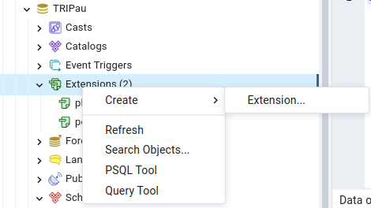

# Pré-traitements PostGis

Ce module permet de pré calculer les tables de la base de données utiles pour l'application TRIvial à partir de commandes postGIS.
Il s'agit cependant d'une version incomplète, le résultat obtenu n'étant pas encore intégrable au projet.

## Etapes

Les étapes suivantes sont implémentées dans le script index.js

- Import bati de la BDTopo : permet d'ajouter une table contenant tous les batis surfaciques dans la base de donnée

    - Import de la partie bati de la BDTopo sur une base de données associée
    - Fusion de toutes les tables bati en une unique table 
    - Copie de cette table dans la base de donnée TRI

- Import PAI de la BDTopo : permet d'ajouter une table contenant tous les points d'intéret dans la base de donnée, ce sont ces points qui sont utilisés dans la BD TRI dans les couches ponctuelles.

    - Import de la partie PAI de la BDTopo sur une base de données associée
    - Fusion de toutes les tables PAI en une unique table 
    - Copie de cette table dans la base de donnée TRI

- Import des données extérieures, la jointure avec les données TRI n'est pas implémentée

    - import de la donnée finess
    - import de la donnée menjva

- Création de la base de donnée TRI

    - import des données TRI
    - pour chaque table TRI ponctuelle, jointure avec les PAI de la BDTopo pour obtenir une information (donnée TRI enrichie)
    - fusion de toutes les tables TRI ponctuelles 
    - jointure entre la table TRI ponctuelle et la table Bati de la BD topo dans une nouvelle table
    - renommage des colonnes de géométrie de cette table TRI enrichie pour définir la géométrie surfacique (originalement celle de la BDTOpo) par défaut
    - fusion de cette table avec toutes les tables surfaciques

On obtient ainsi automatiquement une table des données TRI enrichies par la BD topo

## Améliorations

Pour intégrer la base de donnée produite par ce script dans l'application TRIvial, il est nécéssaire de développer ces nouvelles features :

- Création des bases de donnée automatisée
- Jointure de la base de donnée avec d'autres sources (notamment menjva et finess déjà importées), ou possibilité de réaliser ces jointures "à la volée" dans l'application
- Division de la base de donnée en différents enjeux (santé, patrimoine...)
- Ajout de la gestion des scénarios et des données TRI linéaires 
- Calcul des hauteurs ou des données touchées
- Ce script reste assez rigide et ne s'adapte pas forcément aux données en entrées

## PostGIS

PostGIS est une extension de PostgreSQL, ele permet la manipulation de données géographiques dans les bases de données à partir de commandes SQL. Cette extension doit être ajoutée dans chaque base de donnée utilisée.

## Installation

- à partir de pgAdmin, créer chaque base de donnée présente dans le script index.js (par exemple pour Pau : BDTopoBatiPau2012, BDTopoPAIPau2012, TRIPau)
- ajouter l'extension postGIS pour chacune d'elles



- à la racine de ce dosser, créer un dossier input et y ajouter les données à importer dans la base de donnée, l'exemple ci desous reprend la situation pour le TRI de Pau

    - FRF_TRI_PAU : [donnée TRI](https://www.georisques.gouv.fr/donnees/bases-de-donnees/zonages-inondation-rapportage-2020) (contient tous les shapefile de la donnée TRI)
    - BDTOPOPau2012 : [BD Topo du département concerné](https://geoservices.ign.fr/bdtopo) ,la version dépend des données TRI (contient les dossiers A_RESEAU_ROUTIER, B_VOIES...)
    - etalab.csv : [données liées à la santé FINESS](https://www.data.gouv.fr/fr/datasets/finess-extraction-du-fichier-des-etablissements/)
    - menjva.csv : [données liées à l'enseignement](https://data.education.gouv.fr/explore/dataset/fr-en-adresse-et-geolocalisation-etablissements-premier-et-second-degre/table/?disjunctive.nature_uai&disjunctive.nature_uai_libe&disjunctive.code_departement&disjunctive.code_region&disjunctive.code_academie&disjunctive.secteur_prive_code_type_contrat&disjunctive.secteur_prive_libelle_type_contrat&disjunctive.code_ministere&disjunctive.libelle_ministere)

- dans le fichier poolPg.js, modifier les valeurs pour qu'elles correspondent à la base de donnée (user, password et host) 
- A la racine de ce fichier, lancer dans une invite de commande :
```
npm run start
```


